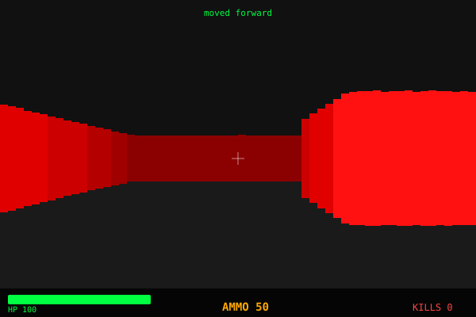

<div align="center">


</div>

---

## Current frame

> **This image updates every time someone opens an issue with a move command.**

<div align="center">



</div>

---

## How to play

Open a GitHub Issue with **exactly** one of these titles:

<div align="center">

| Issue title | Action |
|:-----------:|--------|
| `w` | ⬆️ Move forward |
| `s` | ⬇️ Move back |
| `a` | ⬅️ Turn left |
| `d` | ➡️ Turn right |
| `shoot` | 🔫 Shoot |
| `reset` | 🔄 Reset game |

</div>

**[→ Open an issue to make a move](../../issues/new)**

GitHub Actions picks up the issue, runs the raycaster, commits the new `frame.svg`, and closes the issue with a reply. Takes ~20 seconds.

---

## How it works

```
You open issue titled "w"
         │
         ▼
GitHub Actions triggers (issues: opened)
         │
         ▼
python engine/raycaster.py "w"
  ├─ loads state/game.json
  ├─ applies move to player position
  ├─ casts 60 rays via DDA algorithm
  ├─ projects enemies onto screen plane
  ├─ renders HUD (HP, AMMO, KILLS)
  └─ writes frame.svg + saves state
         │
         ▼
git commit "🎮 [w] frame update by @you"
git push
         │
         ▼
Issue gets a reply + closes automatically
         │
         ▼
README updates in real time (SVG is live)
```

---

## Engine

Pure Python raycaster — no dependencies, no pygame, no OpenGL.

- **DDA raycasting** — 60 rays per frame, fisheye correction
- **Enemy projection** — z-buffered sprite rendering
- **HUD** — health bar, ammo counter, kill counter
- **State** — persisted in `state/game.json` between moves
- **Map** — 20×20 hand-crafted maze with 5 enemies

```python
# the entire render pipeline in one line conceptually:
# for each column → cast ray → compute wall height → draw → project enemies → draw HUD
```

---

## Enemies

There are **5 demons** in the map. Find them and shoot them.

To hit an enemy:
- Face it (it needs to be near the center crosshair)
- Be within range (~8 units)
- Open issue: `shoot`

---

<div align="center">

[](../../issues/new)

[](https://github.com/stompingcrit)


</div>
